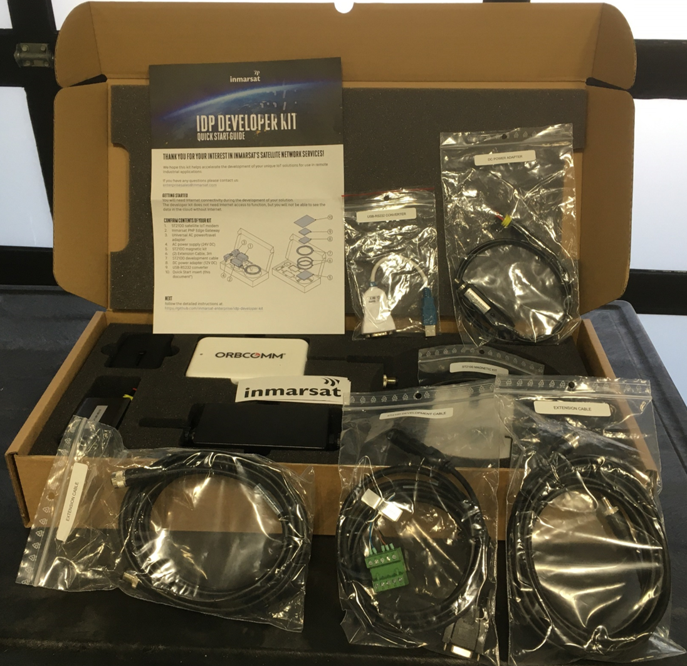

# Inmarsat IsatData Pro Plug-N-Play Developer Kit Quick Start

## Before you begin...

1. You will need a [GitHub](https://github.com) account. Create one for free if
you do not already have one.

2. You should have received the **IDP Developer Kit Welcome Email** from
Inmarsat:

    

3. You should also have received login instructions for the Inmarsat
Solutions IDP Portal (aka *ISIP*).

> If you have not received your welcome email and ISIP login instructions
please contact enterprisesales@inmarsat.com

## Getting Started

We recommend you read the full contents, but if you want to jump-start go
straight to [Modem Activation](docs/modem-activation.md) then
[Kit Installation](docs/kit-installation.md) then
[Network Data](docs/Network-Data.md)

* [System Overview](docs/system-overview.md)
* [Modem Activation](docs/modem-activation.md)
* [Kit Installation](docs/kit-installation.md)
* [Network Data](docs/network-data.md)
* [Using the Sample Application](docs/using-fieldedge-ultralite.md)
* [Next Steps](#Next-Steps)

## Next Steps

Ensure you have access to the following documentation: (right click links to open in a new tab)

* [**Modem Integration Documentation**](https://github.com/inmarsat-enterprise/idp-developer-kit-nda) on our private GitHub repository.
    
* [**IDP Messaging API**](https://developer.inmarsat.com/technology/idp/idp-messaging-api/idp-messaging-api/)
on the Inmarsat Developer Portal.

* *(Optional)* [**FieldEdge Ultralite IDP Project**](https://github.com/inmarsat-enterprise/fieldedge-ultralite)
on our private GitHub repository.

    > Note: if you cannot access the above repositories, contact
    enterprisesales@inmarsat.com to be added as a ***collaborator***.

Inmarsat also provides the following open source reference material:

* [**idpmodem**](https://github.com/inmarsat/idpmodem)
Python 3.x package on PyPI and GitHub interfacing the modem using AT commands.

* [**isatdatapro-api**](https://www.npmjs.com/package/isatdatapro-api)
Node.js package on NPM interfacing a web client to the network API.

* [**Azure IoT Satellite Messaging Reference Architecture**](https://github.com/Inmarsat/isatdatapro-azure)
on GitHub.

[Back to Top](#Inmarsat-IsatData-Pro-Plug-N-Play-Developer-Kit-Quick-Start)

