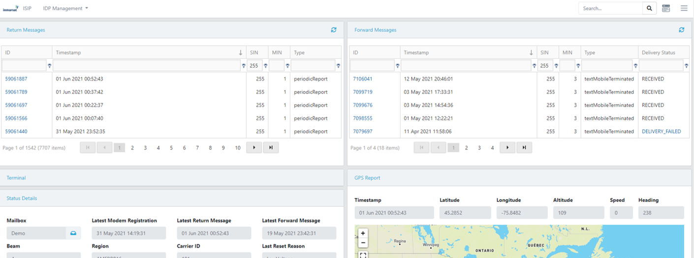

# Inmarsat IsatData Pro Plug-N-Play Developer Kit Quick Start

## Contents

* [System Overview](#System-Overview)
* [Modem Activation](#Modem-Activation)
* [Modem Installation](#Modem-Installation)
* [Network Data](#Network-Data)
* [Field Edge Ultralite Reference Architecture](#Field-Edge-Ultralite-Reference-Architecture)
* [Next Steps](#Next-Steps)
* [Troubleshooting](#Troubleshooting)

## System Overview


* A ***Mailbox*** provides authentication credentials for API calls to the 
Inmarsat service, and provides access to an interest group of devices associated 
with a satellite modem (aka *Mobile*).
    * The ***Satellite Gateway*** is effectively an API server URL in the cloud 
    associated with a network operator (e.g. Inmarsat or ORBCOMM). This is also
    referred to as the *Message Gateway System*.
    * The API architecture requires the client application to poll a Mailbox to
    receive and send messages.  Polling the API does not consume satellite data.

* A ***Mobile*** is the satellite modem associated with a remote Device or Edge 
Gateway, identified by a globally unique *Mobile ID*.  The Mobile could also be 
considered as a data source that includes location services (GNSS) and 
various configuration (e.g. low power mode) and telemetry (e.g. SNR) metadata.

* A ***Message*** contains the data payload sent over the satellite link in a 
given direction:
  * ***Return*** messages (aka Mobile-Originated) are sent from the modem 
  such as telemetry, properties, metadata. The maximum return message size is
  6400 Bytes.
  * ***Forward*** messages (aka Mobile-Terminated) are sent to the modem such 
  as commands or configuration and have corresponding ***Status*** to indicate 
  state and reason for the state. The maximum forward message size is 10kBytes,
  or 5000 Bytes if using low power mode.

The hardware components of the IDP PNP Developer Kit focus on the *Mobile* and
IoT ***Edge Intelligence*** using a reference architecture developed mainly in
Python and running on a low cost Raspberry Pi Zero Wireless.

[Back to Top](#Contents)

## Modem Activation

1. Confirm you have received a **IDP Developer Kit Welcome Email** from
Inmarsat.  You should also have received login instructions for the Inmarsat
Solutions IDP Portal (aka *ISIP*).

    

2. Login to the [**Inmarsat Solutions IDP Portal**](https://isipinmarsat.satcomhost.com/)

    1. Select **Installed Base > Devices**.
        
         Devices" src="media/isip-installed-base.png" width="75%" height="auto">

    2. Click the **Mobile ID** of your ST2100 modem under the **ICCID** column,
    which should be the same as the unique **S/N** identifier on the side of 
    your modem in the format *nnnnnnnnSKYcccc*:

        

    1. Scroll to the bottom of the *Card/Terminal Details* page and click
    **Activate**.

    1. Complete the form by selecting the price plan from the drop down menu and
    click **Confirm** at the bottom.

        

        

    2. You should receive an email confirmation when the activation has
    completed, within a few minutes.

        

[Back to Top](#Contents)

## Modem Installation

### Vehicle Installation

1. Collect the parts of the kit required for a vehicle install.

    

    1. Magnet mount kit
    2. ST2100 modem
    3. (Optional) extension cable(s)
    4. FieldEdge Ultralite "black box"
    5. ST2100 development cable
    6. DC automotive power adapter

2. Attach the magnet mount kit to the ST2100 using the screws provided.
You can route the cable out the long or short side using the provided channel.

    
    

3. Connect the ST2100 to either the extension cable(s) or directly to the
"black box" cable depending the total length of cable run you need.

    

    >Note: If using for an extended period outdoors and/or to protect against
    the metal connector damaging vehicle paint, it is recommended to wrap
    the metal connection point in waterproof tape.

    
    

4. Place the **ST2100** modem in a location with a clear view of the sky
in the direction of the Equator (e.g. south-facing in the northern hemisphere).
Ensure your cabling can run without being damaged.

    
    

5. Connect the **developer breakout cable** to the **Edge Ultralite** "black
box" device and the **developer breakout cable** to a power source using either
the DC automotive or AC/DC adapter cable provided

    
    

6. Using your preferred tablet/smartphone/PC, use the QR code or find and
connect to the WiFi network `isat-feu-device`.
The SSID password is: ***IsatIoT1!*** 
    
    An example using an iOS device is shown below:

    >NOTE: You can use the QR code on the device to automatically connect.

    
    

6. Open a browser and navigate to `http://isatiot:5000`.  It should appear
similar to the following iOS/Safari example:

    >NOTE: If the `isatiot` hostname does not resolve,
    try `http://192.168.27.1:5000`

    

7. Click **IDP** to navigate to the IDP tab.  Confirm you have a connection to
the ST2100 modem.  It should appear similar to the following iOS/Safari example:

    

[Back to Top](#Contents)

## Network Data

1. Using the **Inmarsat Solutions IDP Portal** (aka ISIP) select
**IDP Management > Terminals** then click your Mobile ID from the list.

2. You should see a list of **Return Messages** (aka *Mobile-Originated*) that
includes a **modemRegistration** and a location report.

    

[Back to Top](#Contents)

## Field Edge Ultralite Reference Architecture


[Back to Top](#Contents)

## Next Steps

>NOTE: You can connect the edge device to the Internet on a local WiFi
connection by navigating to the `WiFi` tab on the web GUI and entering your
SSID and PSK. This is useful in order to ssh directly into the Pi0W from your
PC. You can then carry out upgrades to the latest app versions, see
*Troubleshooting* section below for more detail.

Ensure you have access to the following documentation: (right click links to open in a new tab)

* **ST2100 Product Documentation** from the [Documentation Repository](https://github.com/inmarsat-enterprise/idp-developer-kit-nda)
    
    > Note: if you cannot access the repository, contact
    enterprisesales@inmarsat.com to be added as a collaborator.

* [**IDP Messaging API**](https://developer.inmarsat.com/technology/idp/idp-messaging-api/idp-messaging-api/)
on the Inmarsat Developer Portal 

Inmarsat also provides the following open source reference material:

* [**idpmodem**](https://github.com/inmarsat/idpmodem)
Python 3.x package on PyPI and GitHub interfacing the modem using AT commands.

* [**isatdatapro-api**](https://www.npmjs.com/package/isatdatapro-api)
Node.js package on NPM interfacing a web client to the network API.

* [**FieldEdge Ultralite IDP Project**](https://github.com/inmarsat-enterprise/fieldedge-ultralite)
on GitHub

* [**Azure IoT Satellite Messaging Reference Architecture**](https://github.com/Inmarsat/isatdatapro-azure)
on GitHub

[Back to Top](#Contents)

## Troubleshooting

The following section includes information on known/observed behaviours of
the developer kit *Ultralite* platform.

### Upgrade to the latest app versions

> NOTE: for this step you will need a [GitHub Personal Access token](https://docs.github.com/en/github/authenticating-to-github/creating-a-personal-access-token).
You will also need access privileges to the [FieldEdge Ultralite repository](https://github.com/inmarsat-enterprise/fieldedge-ultralite).
If you do not have repository access, contact enterprisessales@inmarsat.com.

Connect to the Pi using SSH either over WiFi or locally using a USB adapter
connected to the `**USB**` port (*NOT* the PWR port).

From the main directory when you login, enter the following:

```
export GITHUB_TOKEN=<YourPersonalAccessToken>
docker-compose up -d --build
```

### Cannot connect to `isat-feu-device` access point

`feuwifi` sometimes will refuse an access point connection with a
**bad password** error.
This is a known issue with the community-developed tool.

First try removing and re-applying power from the FEU device, a reboot will
usually fix the problem.

If you still cannot attach to `isat-feu-device` you can try removing the
cover of the FEU edge device and connecting a micro-USB to USB adapter to
your computer and ssh locally using a terminal shell or a Windows application
such as [PuTTY](www.putty.org).

```
ssh-keygen -R "isatiot.local"

ssh pi@isatiot.local
```

>Note: On some Linux hosts you may need to lookup the MAC address using
`ifconfig` then use network-manager on the **Ethernet** Wired connection 
number with matching address and select IPv4 method as `Link-Local Only`.

### After clicking `Connect` to WiFi network page unresponsive

Sometimes the `feuwifi` connection as a Client to an upstream WiFi network
will cause localhost resolution to be lost, and you may need to connect
remotely to the FEU device to use the GUI when it is on a WiFi network.
This is a known issue with the community-developed tool.

After clicking **Connect** on the GUI WiFi tab if you have input correct
SSID and PSK credentials, you may need to switch WiFi networks from
`isat-feu-idp` to your local WiFi network then navigate to
http://isatiot:5000 to reconnect to the GUI.

Rebooting the FEU device usually also allows re-connection via the
`isat-feu-device` network.