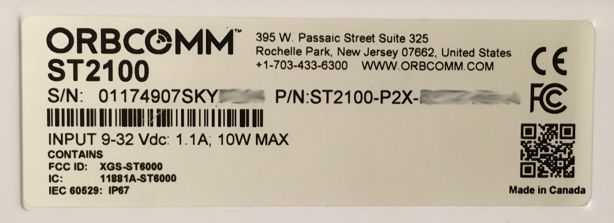
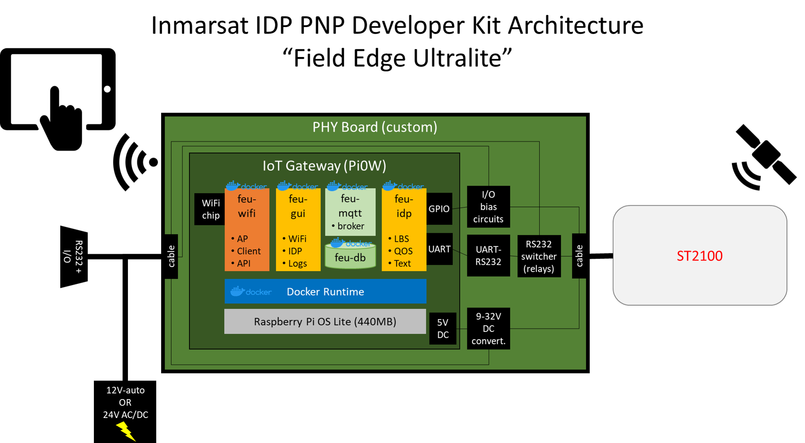

# Inmarsat IsatData Pro Plug-N-Play Developer Kit Quick Start

## Contents

- [Inmarsat IsatData Pro Plug-N-Play Developer Kit Quick Start](#inmarsat-isatdata-pro-plug-n-play-developer-kit-quick-start)
  - [Contents](#contents)
  - [System Overview](#system-overview)
  - [Modem Activation](#modem-activation)
  - [Modem Installation](#modem-installation)
  - [Network Data](#network-data)
  - [Field Edge Ultralite Reference Architecture](#field-edge-ultralite-reference-architecture)
  - [Next Steps](#next-steps)

## System Overview

* A ***Mailbox*** provides authentication credentials for API calls to the 
Inmarsat service, and provides access to an interest group of devices associated 
with a satellite modem (aka *Mobile*).
    * The ***Satellite Gateway*** is effectively an API server URL in the cloud 
    associated with a network operator (e.g. Inmarsat or ORBCOMM). This is also
    referred to as the *Message Gateway System*.
    * The API architecture requires the client application to poll a Mailbox to
    receive and send messages.  Polling the API does not consume satellite data.

* A ***Mobile*** is the satellite modem associated with a remote Device or Edge 
Gateway, identified by a globally unique *Mobile ID*.  The Mobile could also be 
considered a leaf device in that it includes location services (GNSS) and 
various configuration (e.g. low power mode) and telemetry (e.g. SNR) metadata.

* A ***Message*** contains the data payload sent over the satellite link in a 
given direction:
  * ***Return*** messages (aka Mobile-Originated) are sent from the modem 
  such as telemetry, properties, metadata
  * ***Forward*** messages (aka Mobile-Terminated) are sent to the modem such 
  as commands or configuration and have corresponding ***Status*** to indicate 
  state and reason for the state

The hardware components of the IDP PNP Developer Kit focus on the *Mobile* and
IoT ***Edge Intelligence*** using a reference architecture developed mainly in
Python and running on a low cost Raspberry Pi Zero Wireless.

[Back to Top](#Contents)

## Modem Activation

1. Confirm you have received a **IDP Developer Kit Welcome Email** from
Inmarsat.  You should also have received login instructions for the Inmarsat
Solutions IDP Portal (aka *ISIP*).

2. Login to the [**Inmarsat Solutions IDP Portal**](https://isipinmarsat.satcomhost.com/)

    1. Select **Installed Base > Devices**.
        
         Devices" src="media/isip-installed-base.png" width="75%" height="auto">

    2. Click the **Mobile ID** of your ST2100 modem under the **ICCID** column,
    which should be the same as the unique **S/N** identifier on the side of 
    your modem in the format *nnnnnnnnSKYcccc*:

        

    3. Scroll to the bottom of the *Card/Terminal Details* page and click
    **Activate**.

    4. Complete the form by selecting the price plan from the drop down menu and click **Activate** at the bottom.

        

        

    5. You should receive an email confirmation when the activation has
    completed, within a few minutes.

        

[Back to Top](#Contents)

## Modem Installation

3. Place the **ST2100** modem in a location with a clear view of the sky
in the direction of the Equator (e.g. south-facing in the northern hemisphere).
You may use the magnet kit provided in the kit to attach it to a vehicle:

    

    >Note: If using for an extended period outdoors and/or to protect against
    the metal connector damaging vehicle paint, it is recommended to wrap
    the metal connection point in waterproof tape.

4. Connect the **ST2100** to the **Field Edge Ultralite** device directly or
using the extension cables provided.

    

5. Connect the **developer breakout cable** to the **Edge Ultralite** device.

    

6. Connect the **developer breakout cable** to a power source using either
the DC automotive or AC/DC adapter cable provided.

    

7. Using your preferred tablet/smartphone/PC, find and connect to the WiFi
network `isat-feu-device`.  An example using an iOS device is shown below:

    >NOTE: You can use the QR code on the device to automatically connect.

    

8. Open a browser and navigate to `http://isatiot:5000`.  It should appear
similar to the following iOS/Safari example:

    >NOTE: If the `isatiot` hostname does not resolve,
    try `http://192.168.27.1:5000`

    

9. Click **IDP** to navigate to the IDP tab.  Confirm you have a connection to
the ST2100 modem.  It should appear similar to the following iOS/Safari example:

    

[Back to Top](#Contents)

## Network Data

10. Using the **Inmarsat Solutions IDP Portal** (aka ISIP) select
**IDP Management > Terminals** then click your Mobile ID from the list.

11. You should see a list of **Return Messages** (aka *Mobile-Originated*) that
includes a **modemRegistration** and a location report.

    

[Back to Top](#Contents)

## Field Edge Ultralite Reference Architecture

[Back to Top](#Contents)

## Next Steps

>NOTE: You can connect the edge device to the Internet on a local WiFi
connection by navigating to the `WiFi` tab on the web GUI and entering your
SSID and PSK.

Ensure you have access to the following documentation:

* **ST2100 Product Documentation** from the [Inmarsat Sharefile](https://inmarsat.sharefile.com/home/shared)

    * ***IsatData Pro Developer Kit > Modem > Documentation > ST2100***

* [**IDP Messaging API**](https://developer.inmarsat.com/technology/idp/idp-messaging-api/idp-messaging-api/)
on the Inmarsat Developer Portal

Inmarsat also provides the following open source reference material:

* [**idpmodem**](https://github.com/inmarsat/idpmodem)
Python 3.x package on PyPI and GitHub interfacing the modem using AT commands.

* [**isatdatapro-api**](https://www.npmjs.com/package/isatdatapro-api)
Node.js package on NPM interfacing a web client to the network API.

* [**FieldEdge Ultralite IDP Project**](https://github.com/inmarsat-enterprise/feu-idp)
on GitHub

* [**Azure IoT Satellite Messaging Reference Architecture**](https://github.com/inmarsat/azure-isatdatapro)
on GitHub

[Back to Top](#Contents)