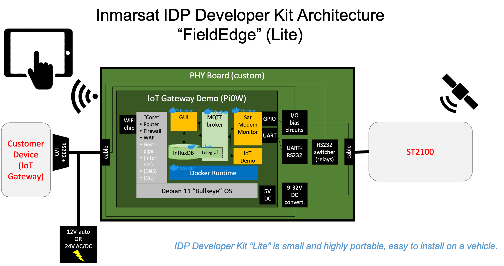

# IoT Demonstration Application

> Note: The FieldEdge "black box" single-board computer is not required to make
use of the satellite modem. You can connect directly to the modem using the
Developer Breakout cable and extension cables, however no messages will be
automaticatlly generated except for a `modemRegistration` on power cycle.

**FieldEdge** is an
[open-source project](https://github.com/orgs/inmarsat-enterprise/projects/1)
developed by Inmarsat to illustrate some key concepts of designing
satellite-enabled IoT applications.

The IsatData Pro Developer Kit includes a reference architecture and simple
application that:

* Monitors IsatData Pro modem signal quality and network status
* Periodically sends reports containing location and signal data
* Allows a user to send and receive text messages via a WiFi-attached device

### Contents:
* [Architecture](#Architecture)
* [Connecting](#How-to-connect-to-the-Human-Machine-Interface)
* [Troubleshooting](#Troubleshooting)
    * [Network not showing Active](#Network-not-showing-Active)
    * [Upgrade to latest app versions](#Upgrade-to-the-latest-app-versions)
    * [Cannot connect to isat-feu-device](#Cannot-connect-to-`isat-feu-device`-access-point)
    * [WiFi network page unresponsive](#WiFi-network-page-unresponsive-after-clicking-`Connect`)

## Architecture



The "black box" included in the developer kit consists of a Raspberry Pi Zero W
("**Pi**") mounted on a custom circuit board that interfaces to the ST2100
satellite modem manufactured by [ORBCOMM](https://orbcomm.com),
providing access to its signalling pins and allowing AT commands/responses to
either be managed by the Raspberry Pi or pass through to a device connected to
the developer breakout cable's DB9 serial port.

An IDP monitor application resides on the Pi and uses AT commands to control
the satellite modem, send periodic data and receive incoming commands or
text messages.

The Pi includes a built-in WiFi chip that can be configured as both an Access
Point and Client. The Access Point functionality (aka *WLAN*) is enabled by
default and allows any WiFi device to connect to the FieldEdge local web server
or SSH to the Raspberry Pi command line interface.

A local web server runs on the Pi and provides a *Graphical-User-Interface*
(GUI) for the IDP modem as well as control of the IoT demo application, some
system information and debug logs.

The demo application can be enabled via the GUI, which also provides an means to
send and receive text messages or location and modem telemetry. When enabled,
the IoT demo will automatically generate modem telemetry/location reports every
15 minutes.

The WiFi client function (aka *WWAN*) can be enabled using the
GUI to allow the Rasbperry Pi to be connected to a local Internet WiFi
connection for the purpose of updating software via an SSH connection.

A time-series database resides on the Pi which stores the IDP telemetry data
and relevant events such as modem connect/disconnect.

An local MQTT broker resides on the Pi which exchanges messages between the
various local microservices (IDP monitor, database, GUI and IoT demo).

[Return to top](#Contents)

## How to connect to the Human-Machine-Interface

1. Using your preferred tablet/smartphone/PC, look for the WiFi network
beginning with **`FieldEdge-<id>`** where `<id>` is a unique 4-character ID
for the specific kit.
The SSID password is: ***IsatIoT1!***
    
    An example using an iOS device is shown below:

<p align="center">
    
</p>

> NOTE: If you see `FieldEdge-****` instead of a unique ID, you should wait a
few moments as the system resets its unique ID.
See [troubleshooting](#Cannot-connect-to-`FieldEdge`-access-point).

1. Open a browser and navigate to `http://fieldedge`.  It should appear
similar to the following iOS/Safari example:

    >NOTE: If the `fieldedge` hostname does not resolve,
    try `http://192.168.253.1` which is the Access Point gateway IP address.

    >Some kits use a Raspberry Pi Zero which has limited processing resources.
    Please be patient allowing the web pages to load.

<p align="center">
    
</p>

1. The home page provides some basic system information and a quick view of
whether the satellite modem is connected.

    >:warning: A System Time warning is normal when the device is not connected
    to the Internet.

1. Select the **Satellite** tab to navigate to the modem details.
It should appear similar to the following iOS/Safari example allowing you to:

    * See the status and signal strength on the network
    * See the low power configuration settings
    * Access a historical plot of signal strength over time

<p align="center">
    
</p>

1. Select the  **IoT** tab to navigate to the demonstration application.
By default, the IoT demo is disabled - you can use the toggle button to start
the demo.

    * The first telemetry message may take a moment to send, and you can refresh
    the page to see the details. You may also manually trigger a report in
    between the 15-minute intervals.
    * Text messages can be sent using the Text Messaging dialog.

    >:information_source: Receiving text messages requires a back-office
    integration not included with the kit, but available by following the
    Azure IoT reference architecture for Non-IP satellite messaging.

<p align="center">
    
</p>

>NOTE: You can connect the FieldEdge device to the Internet on a local WiFi
connection by navigating to the `WiFi` tab on the web GUI and entering your
SSID and PSK. This is useful in order to ssh directly into the Pi0W from your
PC. You can then carry out upgrades to the latest app versions, see
*Troubleshooting* section below for more detail.

[Return to top](#Contents)

<hr>

## Troubleshooting

The following section includes information on known/observed behaviours of
the developer kit **FieldEdge** platform.

* [Cannot connect to FieldEdge access point](#cannot-connect-to-fieldedge-access-point)
* [Cannot load FieldEdge home page](#cannot-load-fieldedge-home-page)
* [Satellite modem not connected](#satellite-modem-not-connected)
* [IoT Demo shows no satellite service]()
* [Upgrading to latest version](#upgrade-to-the-latest-fieldedge-idp-version)

### Cannot connect to `FieldEdge` access point

1. If you scan for WiFi networks and see **`FieldEdge-****`** the device needs a
few moments to determine its unique ID and re-broadcast its unique SSID with
the form `FieldEdge-nnnn` where *nnnn* is the unique ID.

1. If you do not see any FieldEdge SSID within a few minutes of powering up the
kit, try removing and re-applying power from the black box, a reboot will
usually fix the problem.

1. If you still cannot attach to `FieldEdge-nnnn` you can try removing the
cover of the black box and connecting a micro-USB to USB adapter
between the Raspberry Pi and your computer to ssh locally using a terminal shell
or a Windows application such as [PuTTY](www.putty.org).

>Note: On some Linux hosts you may need to lookup the MAC address using
`ifconfig` then use network-manager on the **Ethernet** Wired connection 
number with matching address and select IPv4 method as `Link-Local Only`.

### Cannot load FieldEdge home page

1. After a reboot, the Raspberry Pi (Zero) may take up to 5 minutes to start the
FieldEdge web server and GUI app.

1. If you cannot reach http://fieldedge then try http://192.168.253.1 while
attached to the FieldEdge via its Wifi access point.

1. If you cannot reach either URL after about 5 minutes, you can SSH to the
device and use the following commands:
    ```
    ssh fieldedge@192.168.253.1
    ```
    ```
    [[ "$(docker logs --tail 1 fieldedge-gui)" != *"Booting worker with pid"* ]] \
      && echo "Booting - please wait" || echo "GUI appears to be active"
    ```
    If the above command does not indicate to wait, you may view the live
    progress with the following command:
    ```
    docker logs --follow --tail 5 fieldedge-gui
    ```
    >:warning: If additional logs do not start to appear after 5 minutes
    please contact elevate.support@inmarsat.com.

### Satellite Modem Not Connected

1. If the **Satellite Modem** section of the **Home** page indicates
*Satellite modem not connected* it may be a read timout on the local database.
First navigate to the **Satellite** tab and confirm if modem information is
displayed. If yes, reloading the **Home** page should show an updated status.

1. If the **Satellite** tab indicates there is no connection to the modem it
is most likely that the modem cable was not properly connected when the system
was powered up and may take some time to auto-detect. After ensuring all cables
are properly connected, click the Retry button.

### Satellite Network not showing Active

If the Satellite tab does not show *Network* **`Active`** then your satellite modem
is probably unable to see the satellite or experiencing local multipath
interference. Try to move the modem to a location with clear view of the sky
in the direction of the equator.

>NOTE: If you are trying to use the modem out a window, many windows have
metallic fragments and could affect signal reception. Try to avoid using
indoors.

### Satellite IoT Demo shows No Satellite Service

This situation may happen if the MQTT thread crashes for some reason, which
will be visible with `docker logs fieldedge-idp` and identifying
`Exception in thread MqttThread`. Usually this can be
fixed by restarting the **fieldedge-idp** service when SSH'd into the device:
    ```
    ssh fieldedge@192.168.253.1
    ```
    ```
    docker restart fieldedge-idp
    ```

### Upgrade to the latest fieldedge-idp version

> NOTE: for this step you will need a [GitHub Personal Access token](https://docs.github.com/en/github/authenticating-to-github/creating-a-personal-access-token).
You will also need collaborator access to the [FieldEdge Project repositories](https://github.com/inmarsat-enterprise/projects/1).
If you do not have repository access, contact enterprisessales@inmarsat.com.

Connect to the Pi using SSH either over WiFi or locally using a USB adapter
connected to the `**USB**` port (*NOT* the PWR port).

From the main directory when you login, enter the following:

```
$ ssh fieldedge@192.168.253.1
...
$ export GITHUB_TOKEN=<YourPersonalAccessToken>
$ cd fieldedge && docker-compose --profile idp up -d --build
```

[Return to top](#Contents)

[Return to top](#Contents)

[Back to Developer Kit Quick Start](../README.md#Getting-Started)