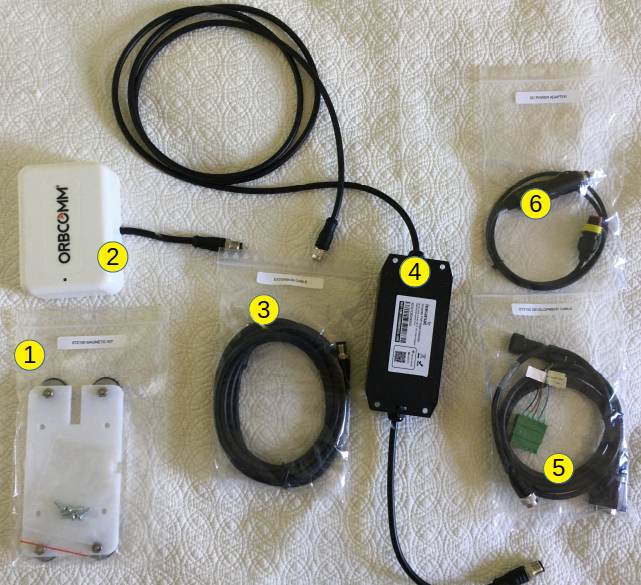
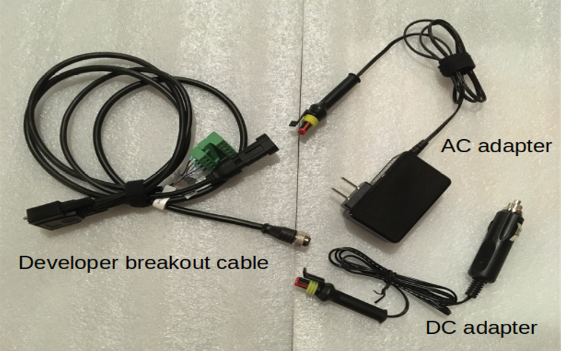

## IDP Developer Kit Installation

>NOTE: The "black box" element of the kit is provided for your convenience to
quickly generate sample data and give you a sense of *art of the possible*.
If you just want to connect your own PC or microcontroller to the ST2100 you
can simply remove the black box from the wiring path and connect directly from
the developer breakout cable to the ST2100, using the extension cable(s) if
necessary.

### Vehicle Installation

1. Collect the parts of the kit required for a vehicle install.

    

    1. Magnet mount kit
    2. ST2100 modem
    3. (Optional) extension cable(s)
    4. FieldEdge Ultralite "black box"
    5. ST2100 development cable
    6. DC automotive power adapter

2. Attach the magnet mount kit to the ST2100 using the screws provided.
You can route the cable out the long or short side using the provided channel.

    
    

3. Connect the ST2100 to either the extension cable(s) or directly to the
"black box" cable depending the total length of cable run you need.

    

    >Note: If using for an extended period outdoors and/or to protect against
    the metal connector damaging vehicle paint, it is recommended to wrap
    the metal connection point in waterproof tape.

    
    

4. Place the **ST2100** modem in a location with a clear view of the sky
in the direction of the Equator (e.g. south-facing in the northern hemisphere).
Ensure your cabling can run without being damaged.

    
    

5. Connect the **developer breakout cable** to the **Edge Ultralite** "black
box" device and the **developer breakout cable** to a power source using either
the DC automotive or AC/DC adapter cable provided

    
    

[Login to the edge device](./demo-application.md#How-to-connect-to-the-Human-Machine-Interface) or
[Back to Developer Kit Quick Start](../README.md#Getting-Started)