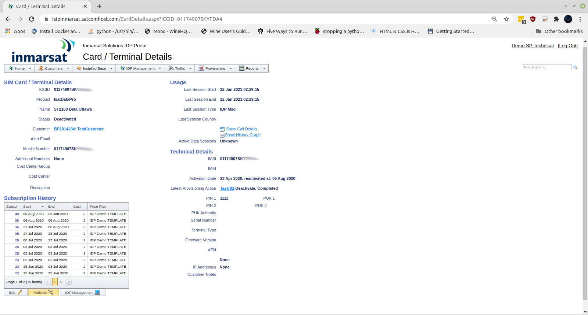
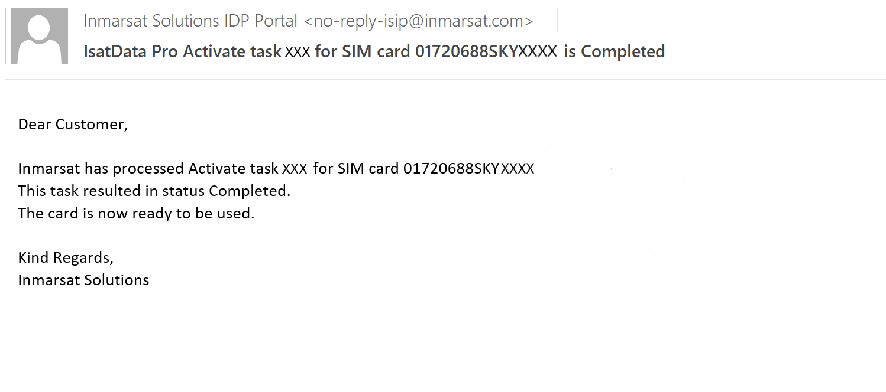

# IDP Modem Activation via ISIP

1. Login to the [**Inmarsat Solutions IDP Portal**](https://isipinmarsat.satcomhost.com/)

2. Select **Installed Base > Devices**.
    
     Devices" src="./media/isip-installed-base.png"
    width="75%" height="auto">

3. Click the **Mobile ID** of your ST2100 modem under the **ICCID** column,
which should be the same as the unique **S/N** identifier on the side of 
your modem in the format *nnnnnnnnSKYcccc*:

    

4. Scroll to the bottom of the *Card/Terminal Details* page and click
**Activate**.

5. Complete the form by selecting the price plan from the drop down menu and
click **Confirm** at the bottom.

    

    

6. You should receive an email confirmation when the activation has
completed, within a few minutes.

    

[Back to Developer Kit Quick Start](../README.md#Getting-Started)