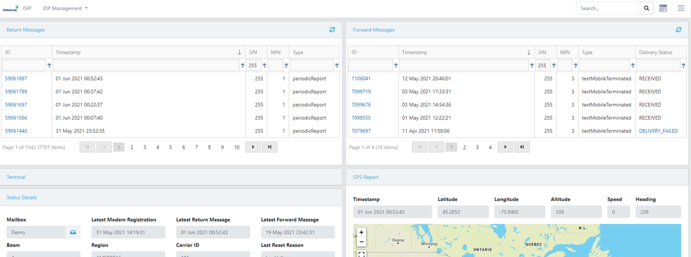

## Network Data

Data sent over the IsatData Pro network is accessed using the Inmarsat
[**IDP Messaging API**](https://developer.inmarsat.com/technology/idp/idp-messaging-api/).
The ISIP portal uses that API to present data for troubleshooting and implements
some basic remote commands to interact with modems.
>You can create a free account at https://developer.inmarsat.com/sign-up/

1. Using the **Inmarsat Solutions IDP Portal** (aka ISIP) select
**IDP Management > Terminals** then click your Mobile ID from the list.

2. You should see a list of **Return Messages** (aka *Mobile-Originated*) that
includes a **modemRegistration**. If you have enabled the IoT Demo Application
you should also see some **periodicReport** messages.

    

[Back to Developer Kit Quick Start](../README.md#Getting-Started)
[Continue to Using the Demo Application](./demo-application.md)