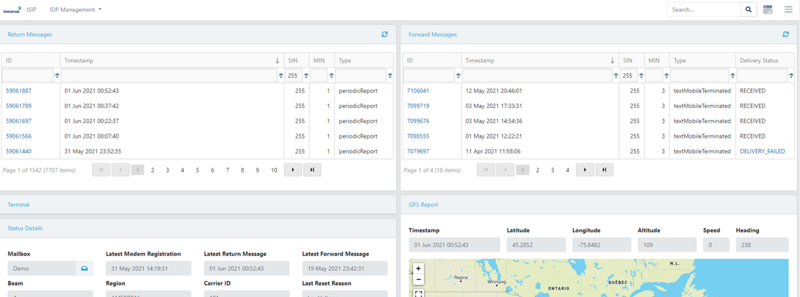

## Network Data

1. Using the **Inmarsat Solutions IDP Portal** (aka ISIP) select
**IDP Management > Terminals** then click your Mobile ID from the list.

2. You should see a list of **Return Messages** (aka *Mobile-Originated*) that
includes a **modemRegistration** and perhaps some **periodicReport** messages.

    

[Back to Developer Kit Quick Start](../README.md#Getting-Started)