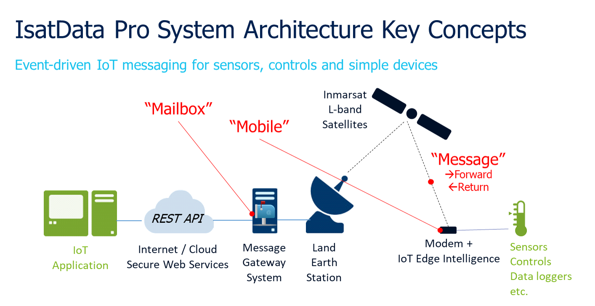

# IsatData Pro System Overview

* A ***Mailbox*** provides authentication credentials for API calls to the 
Inmarsat service, and provides access to an interest group of devices associated 
with a satellite modem (aka *Mobile*).
    * The ***Satellite Gateway*** is effectively an API server URL in the cloud 
    associated with a network operator (e.g. Inmarsat or ORBCOMM). This is also
    referred to as the *Message Gateway System*.
    * The API architecture requires the client application to poll a Mailbox to
    receive and send messages.  Polling the API does not consume satellite data.

* A ***Mobile*** is the satellite modem associated with a remote Device or Edge 
Gateway, identified by a globally unique *Mobile ID*.  The Mobile could also be 
considered as a data source that includes location services (GNSS) and 
various configuration (e.g. low power mode) and telemetry (e.g. SNR) metadata.

* A ***Message*** contains the data payload sent over the satellite link in a 
given direction:
  * ***Return*** messages (aka Mobile-Originated) are sent from the modem 
  such as telemetry, properties, metadata. The maximum return message size is
  6400 Bytes.
  * ***Forward*** messages (aka Mobile-Terminated) are sent to the modem such 
  as commands or configuration and have corresponding ***Status*** to indicate 
  state and reason for the state. The maximum forward message size is 10kBytes,
  or 5000 Bytes if using low power mode.

The hardware components of the IDP PNP Developer Kit focus on the *Mobile* and
IoT ***Edge Intelligence*** using a reference architecture developed mainly in
Python and running on a low cost Raspberry Pi Zero Wireless.

## Global Coverage

IsatData Pro is a global service offered on Inmarsat's geostationary L-band
satellites.

>NOTE: Some countries may require special licensing to offer service, you
can find out more by contacting your local Inmarsat or partner representative.

[Back to Developer Kit Quick Start](../README.md#Getting-Started)