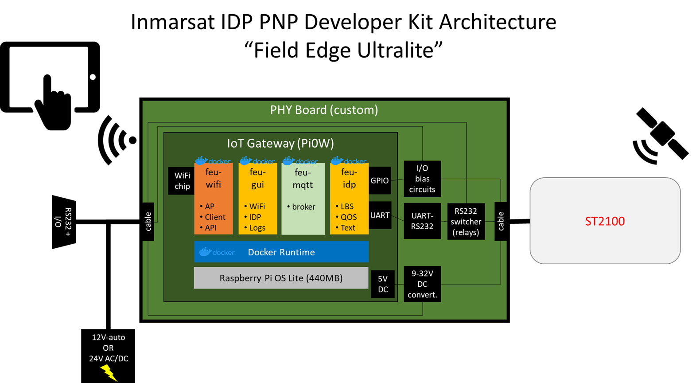
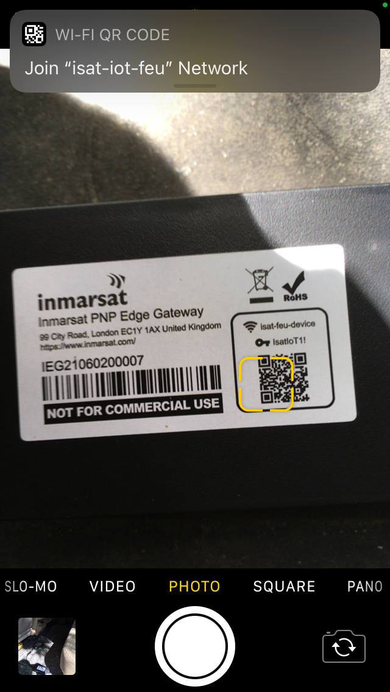
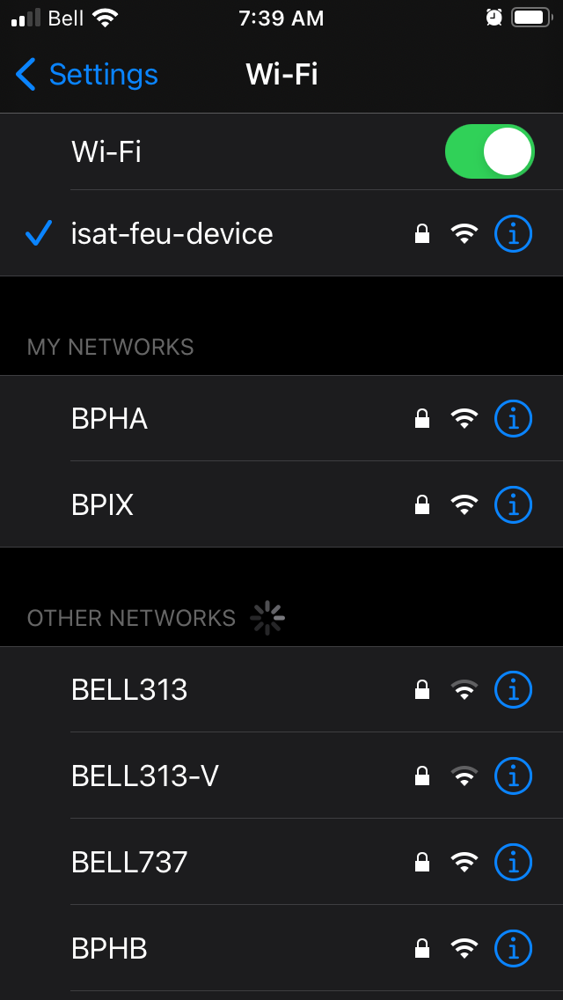
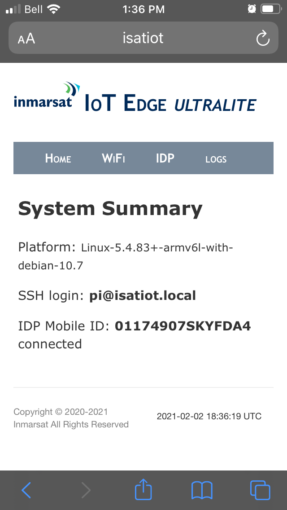

# Using the IDP Developer Kit "FieldEdge Ultralite"

> Note: FieldEdge Ultralite "black box" is not required to make use of the
ST2100 modem. You can connect directly to the modem using the Developer
Breakout cable and extension cables.

**FieldEdge *Ultralite*** is an open-source project developed by Inmarsat to
illustrate some key concepts of designing satellite-enabled IoT applications.

The IsatData Pro Developer Kit includes a reference architecture and simple
application that:

* Monitors IsatData Pro signal quality and network status
* Periodically sends reports containing location and signal data
* Allows a user to send and receive text messages via a WiFi client device

### Contents:
* [Architecture](#Architecture)
* [Connecting](#How-to-connect-to-the-Human-Machine-Interface)
* [Troubleshooting](#Troubleshooting)
    * [Network not showing Active](#Network-not-showing-Active)
    * [Upgrade to latest app versions](#Upgrade-to-the-latest-app-versions)
    * [Cannot connect to isat-feu-device](#Cannot-connect-to-`isat-feu-device`-access-point)
    * [WiFi network page unresponsive](#WiFi-network-page-unresponsive-after-clicking-`Connect`)

## Architecture



The "black box" included in the developer kit consists of a Raspberry Pi Zero W
("**Pi**") mounted on a custom circuit board that interfaces to the ST2100,
providing access to the I/O and allowing AT commands/responses to either be
managed by the Raspberry Pi or pass through to a device connected to the
developer breakout cable's DB9 serial port.

The Pi includes a built-in WiFi chip that has been configured as both an Access
Point and Client. The access point functionality allows any WiFi client device
to connect and use the local web server to interface with the IDP application
for example send a text message. The client function allows the
Rasbperry Pi to be connected to a local Internet WiFi connection for the
purpose of updating software and remote SSH connection.

A local web server runs on the Pi and provides a *Human-Machine-Interface* to
the IDP modem as well as allows connection to a WiFi Internet. The web server
provides an interface to send and receive text messages or location, and check
logs of the various local microservices.

A tiny database resides on the Pi which stores IDP messages and interaction
messages betweeen the various local microservices.

An MQTT broker resides on the Pi which exchanges messages between the various
local microservices.

An IDP interface application resides on the Pi and uses AT commands to control
the satellite modem, send periodic data and receive incoming commands or
text messages.

[Return to top](#Contents)

## How to connect to the Human-Machine-Interface

1. Using your preferred tablet/smartphone/PC, use the QR code or find and
connect to the WiFi network `isat-feu-device`.
The SSID password is: ***IsatIoT1!*** 
    
    An example using an iOS device is shown below:

    >NOTE: You can use the QR code on the device to automatically connect.

    
    

> NOTE: If you cannot establish a connection to `isat-fe-device` try removing
and re-applying power to the "black box".
See [troubleshooting](#Cannot-connect-to-`isat-feu-device`-access-point).

2. Open a browser and navigate to `http://isatiot:5000`.  It should appear
similar to the following iOS/Safari example:

    >NOTE: If the `isatiot` hostname does not resolve,
    try `http://192.168.27.1:5000`

    

    >NOTE: If you have not connected the device to Internet you will not see a WiFi section and SSH login will be `pi@isatiot`

3. Click **IDP** to navigate to the IDP tab.  Confirm you have a connection to
the ST2100 modem.  It should appear similar to the following iOS/Safari example:

    

>NOTE: You can connect the FieldEdge device to the Internet on a local WiFi
connection by navigating to the `WiFi` tab on the web GUI and entering your
SSID and PSK. This is useful in order to ssh directly into the Pi0W from your
PC. You can then carry out upgrades to the latest app versions, see
*Troubleshooting* section below for more detail.

[Return to top](#Contents)

## Troubleshooting

The following section includes information on known/observed behaviours of
the developer kit *Ultralite* platform.

### Network not showing Active

If the IDP tab does not show *Network* **`Active`** then your satellite modem
is probably unable to see the satellite or experiencing local multipath
interference. Try to move the modem to a location with clear view of the sky
in the direction of the equator.

>NOTE: If you are trying to use the modem out a window, many windows have
metallic fragments and could affect signal reception. Try to avoid using
indoors.

### Upgrade to the latest app versions

> NOTE: for this step you will need a [GitHub Personal Access token](https://docs.github.com/en/github/authenticating-to-github/creating-a-personal-access-token).
You will also need access privileges to the [FieldEdge Ultralite repository](https://github.com/inmarsat-enterprise/fieldedge-ultralite).
If you do not have repository access, contact enterprisessales@inmarsat.com.

Connect to the Pi using SSH either over WiFi or locally using a USB adapter
connected to the `**USB**` port (*NOT* the PWR port).

From the main directory when you login, enter the following:

```
export GITHUB_TOKEN=<YourPersonalAccessToken>
docker-compose up -d --build
```
[Return to top](#Contents)

### Cannot connect to `isat-feu-device` access point

`feuwifi` sometimes will refuse an access point connection with a
**bad password** error.
This is a known issue with the community-developed tool.

First try removing and re-applying power from the FEU device, a reboot will
usually fix the problem.

If you still cannot attach to `isat-feu-device` you can try removing the
cover of the FEU edge device and connecting a micro-USB to USB adapter to
between the Raspberry Pi and your computer to ssh locally using a terminal shell
or a Windows application such as [PuTTY](www.putty.org).

```
ssh-keygen -R "isatiot.local"

ssh pi@isatiot.local
```

>Note: On some Linux hosts you may need to lookup the MAC address using
`ifconfig` then use network-manager on the **Ethernet** Wired connection 
number with matching address and select IPv4 method as `Link-Local Only`.

[Return to top](#Contents)

### WiFi network page unresponsive after clicking `Connect`

Sometimes the `feuwifi` connection as a Client to an upstream WiFi network
will cause localhost resolution to be lost, and you may need to connect
remotely to the FEU device to use the GUI when it is on a WiFi network.
This is a known issue with the community-developed tool.

After clicking **Connect** on the GUI WiFi tab if you have input correct
SSID and PSK credentials, you may need to switch WiFi networks from
`isat-feu-idp` to your local WiFi network then navigate to
http://isatiot:5000 to reconnect to the GUI.

Rebooting the FEU device usually also allows re-connection via the
`isat-feu-device` network.

[Return to top](#Contents)

[Back to Developer Kit Quick Start](../README.md#Getting-Started)